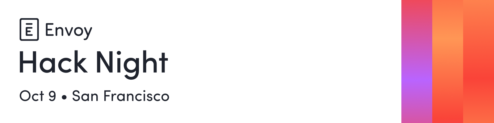

### What's the goal?

Build an app for Screens, Envoy's upcoming digital signage platform.

### Where to start?

1. Make sure you have a GitHub account (https://github.com/signup)
2. Fork this repository
3. Fill in the team/app form below
4. Start hacking!

### Rules

- You have only 2 hours to build the entire app
- You can use any technology, frameworks, etc. you're comfortable with
- You may use AI to assist you, but remember you'll be graded on quality
- Bonus points for leveraging a hardware API (camera, flashlight, etc.)

 

---

### Team name

<!-- Team name -->

### Team members

1. \_<!-- Team member -->
2. \_<!-- Team member (optional) -->
3. \_<!-- Team member (optional) -->

### App name

<!-- App name -->

### App description (optional)

<!-- App description -->

 

---

### App ideas

- Social wall: Instagram, Facebook, X, etc. social posts in a scrolling live feed
- Birthdays: Employee birthdays this week
- Weather: The weather right now at that location
- Countdown: Countdown clock with a description of what it's counting down to
- Transit: Local bus, train, etc. routes and their next departure time
- Live TV: Stream live TV over IP
- Stock: Live stock performance for a specific stock
- News ticker: Latest headlines from a TechCrunch, Reuters, NYT, etc.
- Slack Shoutouts: Spotlight shoutouts or kudos messages in real time
- Energy dashboard: Live office power usage, temperature, etc.
- Food menus: Today’s cafeteria menu, nearby restaurants’ lunch specials
- Fun facts/trivia: Random facts or quizzes
- Quote of the day: A random quote of the day
- Music: Play a music with cool on-screen graphics
- Mood board: Live office sentiment via reactions (smiley/frown counts)
- AI art: Generate a new AI image every day as an art wall
